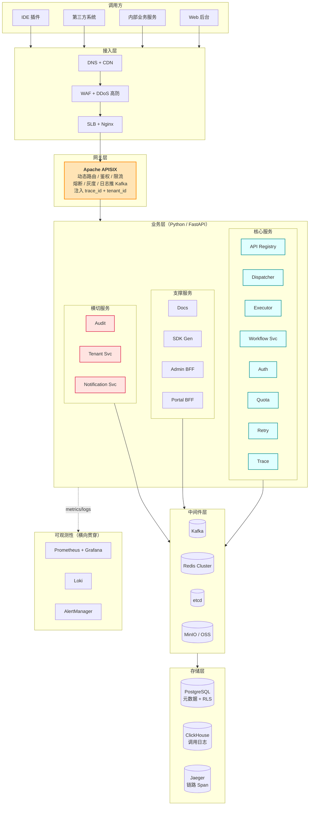
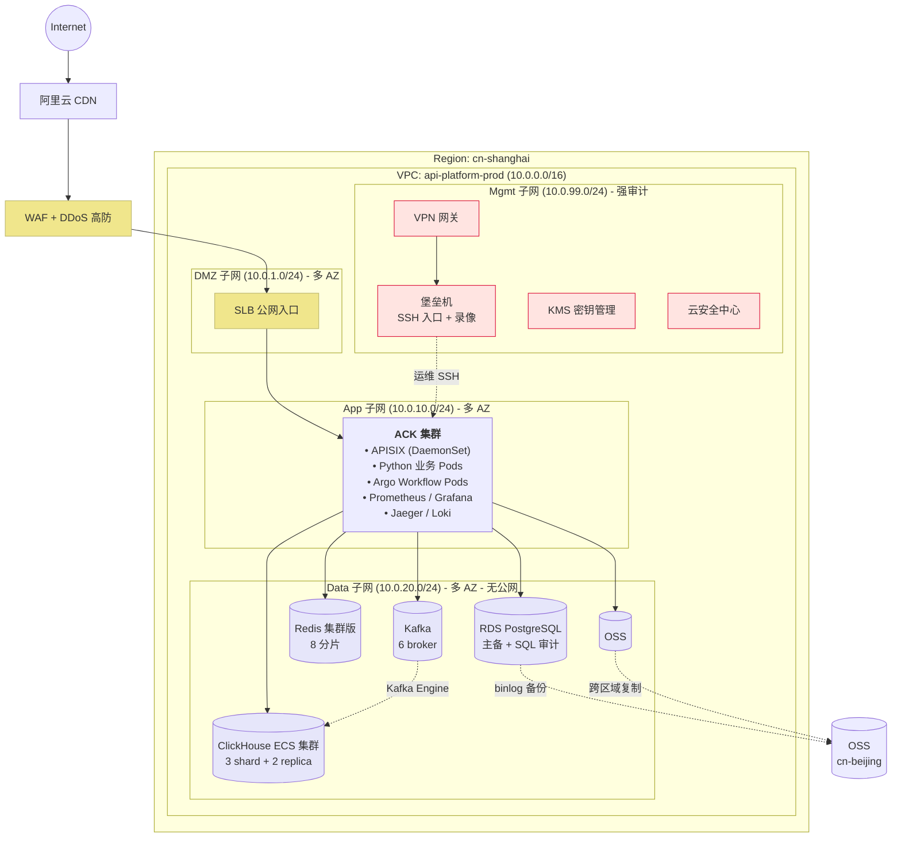
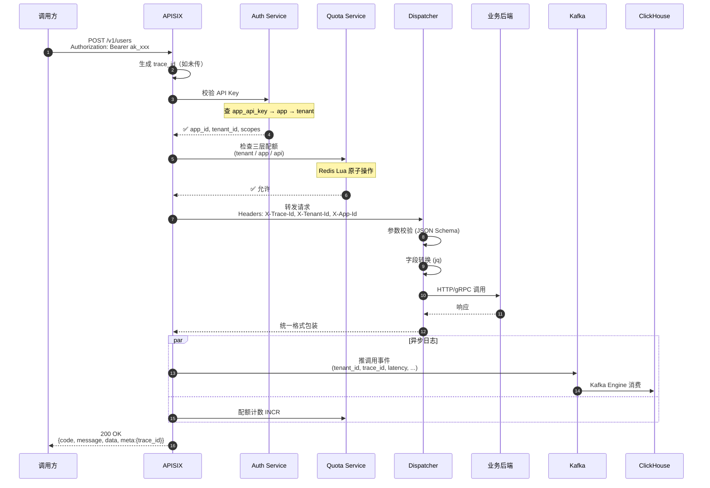
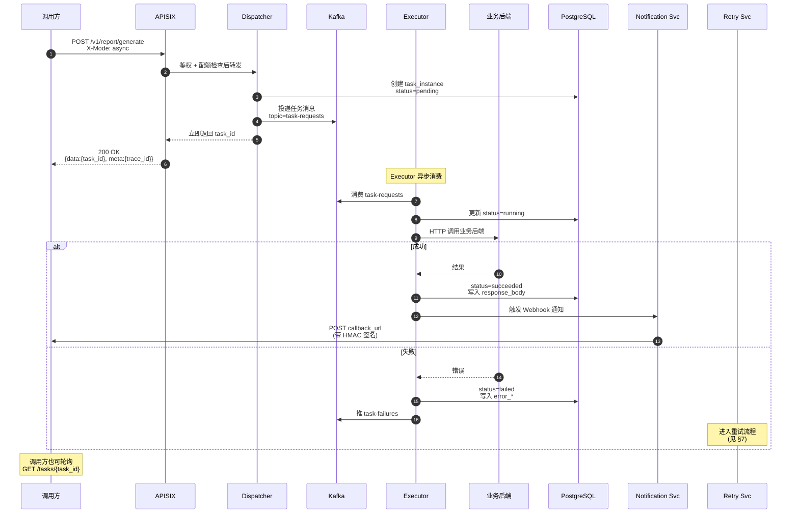
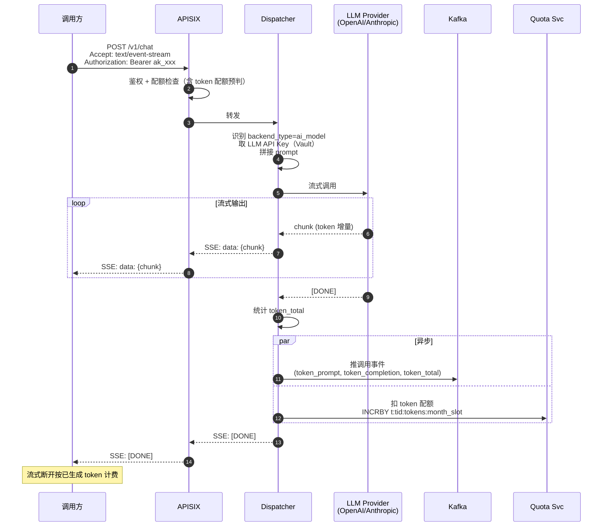
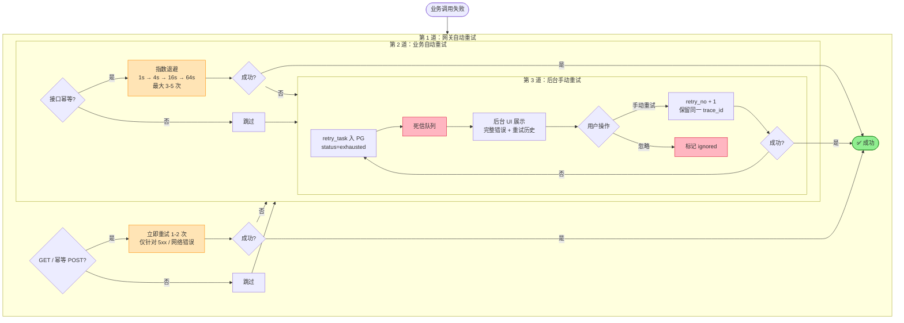
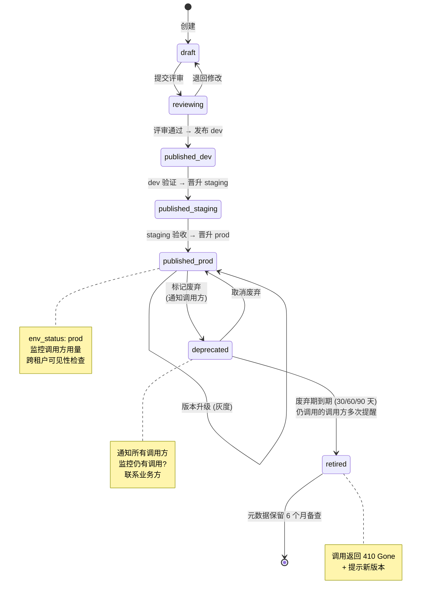
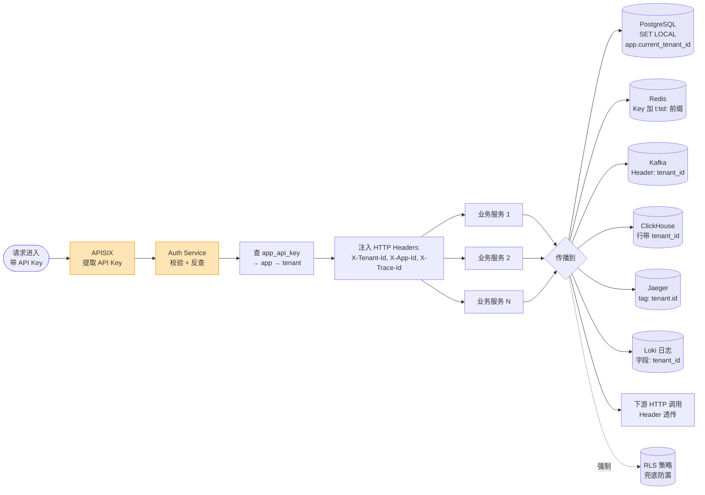
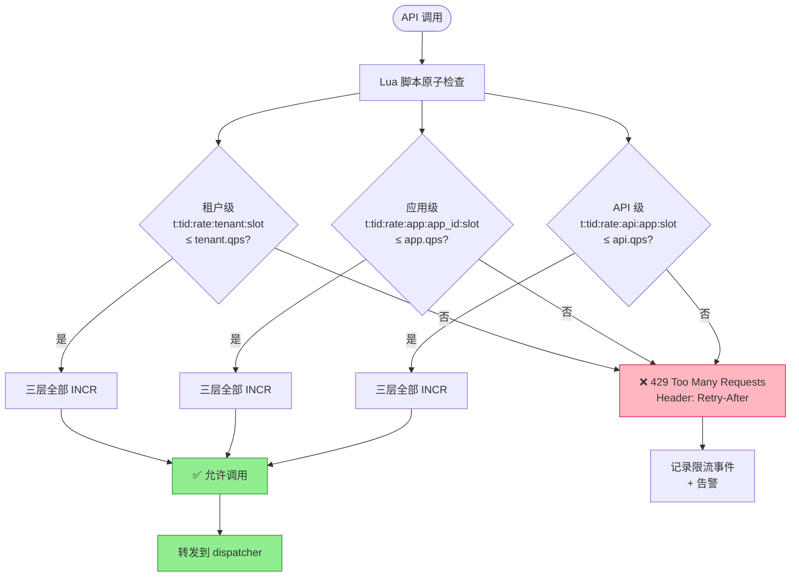
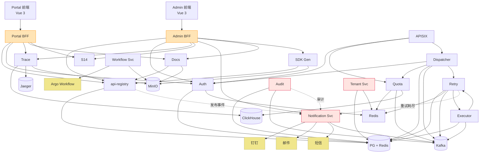

# 架构图集

> 所有图使用 [Mermaid](https://mermaid.js.org/) 语法，可在 GitHub、VS Code、JetBrains、Typora 等工具直接渲染。
>
> 如需转 draw.io：复制对应 mermaid 代码 → draw.io `Extras → Insert → Advanced → Mermaid`。
>
> 如需导出 PNG/SVG：用 [mermaid.live](https://mermaid.live/) 在线渲染。

## 目录

1. [整体架构（分层）](#1-整体架构分层)
2. [部署拓扑（单 Region / 阿里云）](#2-部署拓扑单-region--阿里云)
3. [同步调用时序图](#3-同步调用时序图)
4. [异步任务时序图](#4-异步任务时序图)
5. [AI 流式调用时序图](#5-ai-流式调用时序图)
6. [接口发布流程（分级审批）](#6-接口发布流程分级审批)
7. [失败三道防线（重试）](#7-失败三道防线重试)
8. [API 生命周期状态机](#8-api-生命周期状态机)
9. [多租户上下文传播](#9-多租户上下文传播)
10. [三层配额决策](#10-三层配额决策)
11. [数据流（Kafka → ClickHouse）](#11-数据流kafka--clickhouse)
12. [微服务依赖](#12-微服务依赖)

---

## 1. 整体架构（分层）



**关键说明**：
- **APISIX 扛 80% 流量**（路由/限流/鉴权都是 Nginx 级），Python 业务层只做编排
- **横切服务**（tenant/notification/audit）独立部署，所有业务服务都可调用
- **可观测性贯穿所有层**，不在主流量链路上

---

## 2. 部署拓扑（单 Region / 阿里云）



**等保 2.0 三级要点**：
- DMZ / App / Data / Mgmt **四子网隔离**，安全组严格白名单
- Data 子网**无公网出口**（仅 NAT 网关白名单）
- 所有运维经**堡垒机**（强制审计 + 双因素）
- 跨 Region 仅备份（PG binlog + OSS 复制），不做多活

---

## 3. 同步调用时序图



**关键性能点**：
- 步骤 4-5：API Key 元数据缓存 10min，命中率 > 99%
- 步骤 6-7：Redis 限流决策 < 1ms
- 步骤 11：异步推 Kafka，**不阻塞主链路**
- 同步调用 P99 目标 < 200ms（不含业务后端）

---

## 4. 异步任务时序图



**关键设计**：
- 调用方**立即拿到 task_id**，不等待处理
- 结果通过 **Webhook 回调**（HMAC 签名验证）或**轮询**获取
- 失败自动进入重试流程

---

## 5. AI 流式调用时序图



**关键设计**：
- SSE 协议（`text/event-stream`），每个 chunk 立即转发
- 配额按 token 数扣，不是按调用次数
- **流式中断按已生成 token 计费**
- LLM 调用失败**不重试**（昂贵且非幂等）

---

## 6. 接口发布流程（分级审批）

```mermaid
flowchart TD
    Start([提交发布]) --> EnvCheck{目标环境?}
    
    EnvCheck -->|dev| AutoPath
    EnvCheck -->|staging| SimplePath
    EnvCheck -->|prod| StrictPath
    
    subgraph AutoPath["dev 自助发布"]
        A1[接口提供方自助] --> A2[直接应用]
    end
    
    subgraph SimplePath["staging 简单审批"]
        B1[钉钉机器人推送到业务群]
        B2[业务负责人点"同意"]
        B3[审批通过]
        B1 --> B2 --> B3
    end
    
    subgraph StrictPath["prod 强审批"]
        C1[钉钉审批流<br/>多级: 业务负责人 + 平台运维]
        C2[审批通过]
        C1 --> C2
    end
    
    A2 --> Apply
    B3 --> Apply
    C2 --> Apply
    
    Apply[应用变更] --> Reg[api-registry<br/>写元数据 + tenant_id]
    Reg --> Apisix[写 etcd<br/>APISIX 路由]
    Apisix --> Cache[失效 Redis 缓存<br/>t:tid:api:*]
    Cache --> Docs[触发 docs / sdk-gen]
    Docs --> Audit[审计记录<br/>含 actor + auth_method]
    Audit --> Notify[notification-svc<br/>通知受影响调用方]
    
    Notify --> Gray{需要灰度?}
    Gray -->|是| Canary[Argo Rollouts<br/>5% → 25% → 50% → 100%]
    Gray -->|否| Done([完成])
    Canary --> Done

    classDef gateway fill:#FFE4B5,stroke:#FF8C00
    classDef audit fill:#FFE4E1,stroke:#DC143C
    class Apply gateway
    class Audit audit
```

**生效时间目标**：审批通过后 < 10s 路由可用。

**审批流分级**（[ADR-005](00-decisions.md#adr-005-审批流强度)）：
- **dev**：无审批，自助
- **staging**：钉钉群里点同意即可
- **prod**：钉钉审批流（多级），含灰度策略

---

## 7. 失败三道防线（重试）



**幂等性强制**：
- 接口元数据声明 `idempotent: true` 才允许自动重试
- 调用方应携带 `Idempotency-Key`，业务方据此去重

---

## 8. API 生命周期状态机



**关键**：
- 每个环境独立状态机（`env_status` 字段）
- 跨环境晋升需走对应审批（dev 自助 / staging 简单 / prod 强审批）
- retired 后调用返回 `410 Gone`

---

## 9. 多租户上下文传播



**双重隔离**：
- **应用层**：所有查询强制 `WHERE tenant_id = ?`
- **数据库层**：PostgreSQL RLS（Row Level Security）兜底，即使应用层漏写 WHERE，也无法跨租户读

详见 [11-multi-tenant.md](11-multi-tenant.md)。

---

## 10. 三层配额决策



**三层配额**（[ADR-009 多租户](00-decisions.md#adr-009-多租户策略)）：
- **租户级**：整个租户的总配额（防止单租户拖垮平台）
- **应用级**：单应用的配额（防止单应用滥用）
- **API 级**：单接口限流（保护接口稳定性）

三者**取最严**，Redis Lua 脚本原子操作（避免 race condition）。

---

## 11. 数据流（Kafka → ClickHouse）

```mermaid
graph LR
    subgraph Producers["数据生产者"]
        P1[APISIX]
        P2[Dispatcher]
        P3[Executor]
        P4[Auth / Quota]
        P5[业务服务]
    end
    
    subgraph Kafka["Kafka 集群 (6 broker)"]
        T1[(api-call-events<br/>64 分区)]
        T2[(task-requests<br/>32 分区)]
        T3[(task-failures<br/>16 分区)]
        T4[(audit-events<br/>8 分区)]
        T5[(notification-events<br/>8 分区)]
        T6[(billing-events<br/>4 分区<br/>Phase 3)]
    end
    
    subgraph Consumers["消费者"]
        C1[ClickHouse Kafka Engine]
        C2[Retry Handler]
        C3[Audit Writer]
        C4[Notification Svc]
        C5[Billing Aggregator<br/>Phase 3]
    end
    
    subgraph Storage["持久化存储"]
        S1[(("ClickHouse<br/>api_call_log<br/>MergeTree"))]
        S2[(("PostgreSQL<br/>audit_log / retry_task"))]
        S3[钉钉/邮件/短信/Webhook]
        S4[(("PostgreSQL<br/>billing_record"))]
    end
    
    P1 & P2 & P4 --> T1
    P2 --> T2
    P3 --> T3
    P1 & P5 --> T4
    P2 --> T5
    P3 --> T6
    
    T1 -->|Kafka Engine<br/>JSONEachRow| C1 --> S1
    T3 --> C2 --> S2
    T4 --> C3 --> S2
    T5 --> C4 --> S3
    T6 --> C5 --> S4
    
    S1 --> MV1[物化视图<br/>api_call_stats_by_tenant]
    S1 --> MV2[物化视图<br/>实时大盘]
    
    classDef producer fill:#E0FFFF,stroke:#008B8B
    classDef consumer fill:#FFE4B5,stroke:#FF8C00
    classDef storage fill:#E6E6FA,stroke:#9370DB
    class P1,P2,P3,P4,P5 producer
    class C1,C2,C3,C4,C5 consumer
    class S1,S2,S3,S4 storage
```

**关键设计**：
- **Python 业务服务不直接写 ClickHouse**，避免阻塞主链路
- ClickHouse Kafka Engine 直接消费，2s 攒批写入
- 调用日志按 tenant_id + api_id 排序，单租户查询秒回
- 物化视图实时聚合（按小时 / 按租户 / 按 API）

---

## 12. 微服务依赖



**核心规则**：
- 横切服务（Audit / Tenant / Notification）可被任何服务调用，但**不调用业务核心服务**（避免循环依赖）
- 业务核心服务依赖横切服务时走 **Kafka 异步事件**（解耦）
- Dispatcher 是**主流量入口**，依赖最重（Auth + Quota + Kafka + Retry）

---

## 渲染工具推荐

| 工具 | 用途 |
|------|------|
| **GitHub** | 直接预览（原生支持 mermaid） |
| **VS Code** | Markdown Preview Enhanced 或 Mermaid 插件 |
| **JetBrains** | 内置支持（2023.1+） |
| **[mermaid.live](https://mermaid.live/)** | 在线渲染 + 导出 PNG/SVG |
| **draw.io** | `Extras → Insert → Advanced → Mermaid` |
| **Typora / Obsidian** | 原生支持 |

## 更新约定

- 修改架构时**必须同步更新本文档**
- 图修改后，对应的文档（01-architecture.md / 03-services.md / 等）也要同步
- PR 评审时检查图与代码是否一致
